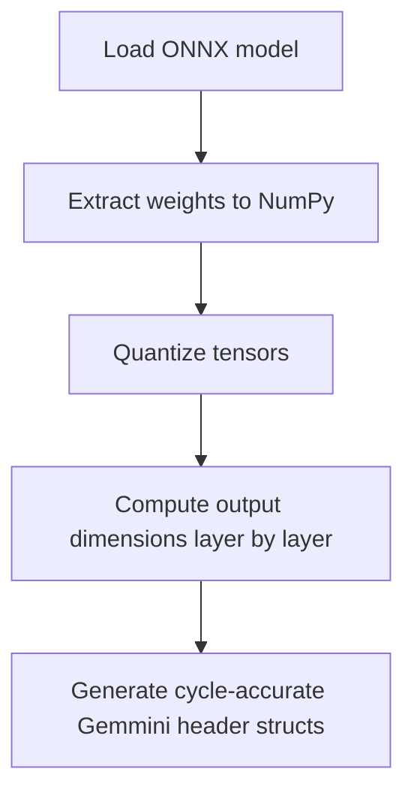

# Onnx2gemmini

A utility to convert **ONNX** models into **C header files compatible with Gemmini**, enabling cycle-accurate simulation of neural networks on the Gemmini accelerator within the **Chipyard / FireSim** ecosystem.

## Features

* Supports ONNX layers: Convolution (Conv), Fully Connected (Gemm), Pooling (MaxPool/AveragePool), and safe buffer propagation for non-computational nodes.
* Automatic quantization (**8-bit or 16-bit**) with scale and shift calculation.
* Automatically handles **Conv + ReLU + Pool** fusion.
* Generates a standalone **Header file (`.h`)** containing quantized weights, biases, input/output buffers, and parameter structs (`ConvParams` and `FcParams`).

## Output File Structure

After conversion, the specified output directory (`--out`) will contain the generated header file reflecting the chosen bit precision:
`<basename>_params_int<precision>.h`

## How to Use

### Requirements

Create and activate the conda environment:

```shell
conda env create -f environment.yml
conda activate onnx2gemmini

```

### Execution

```shell
python3 onnx2gemmini.py model.onnx --out <output_dir> --precision <8|16> --batch_size <N>

```

### Arguments

| Flag | Description | Default |
| --- | --- | --- |
| `onnx` | Path to ONNX model (required) | — |
| `--out` | Output directory | `out` |
| `--precision` | Quantization target: `8` or `16` bits | `8` |
| `--batch_size` | Batch size for buffer allocation | `4` |

### Complete Example

```shell
python3 onnx2gemmini.py resnet50.onnx --out resnet50_gemmini --precision 8 --batch_size 1

```

This will generate:

```text
resnet50_gemmini/
└─ resnet50_gemmini_params_int8.h

```

## Internal Workflow



## 🔍 Current Limitations

* Partial support for very deep networks with multi-branch non-linear architectures.
* Unsupported layers: Softmax, BatchNorm (requires prior fusion), Upsampling.
* ONNX models must include embedded weights (`initializer`).

## Roadmap

* Per-channel quantization support
* Support for networks with branches (e.g., ResNet skip connections)
* Automatic generation of test images

## License

MIT License — free for academic and commercial use, with attribution to the author.